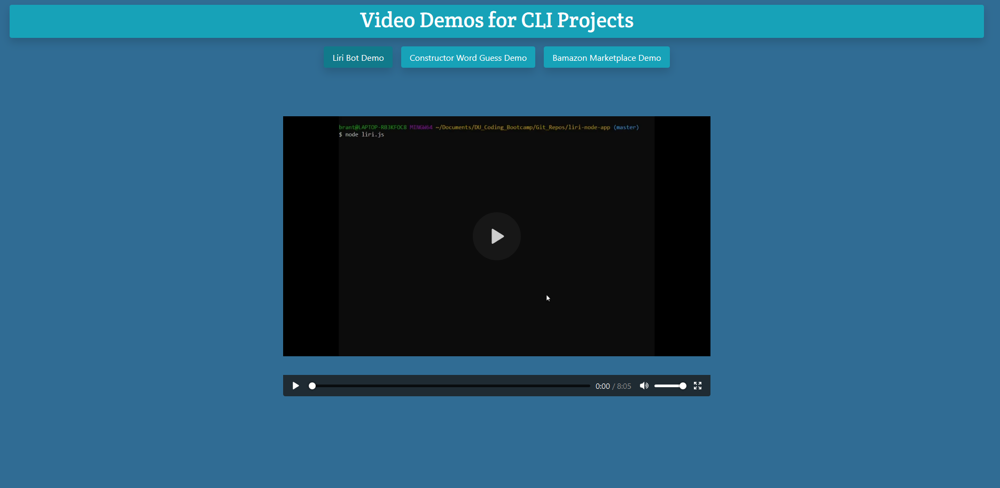

# Backend-Demos

A landing page for demo videos related to CLI applications.

## Getting Started

Cloning and forking with git are easy. To clone, head over to [Backend-Demos](https://github.com/BrantKeener/Backend-Demos) and navigate using the clone or download button. Copy the link, and perform 
`git clone {copied link}`.

### Prerequisites

This application runs without any dependencies. After forking or cloning, no further installs will be necessary.

### Installing

This application runs without any dependencies. Simply fork or clone.

## Deployment

This applicaton deploys easily to github pages. Simply navigate to settings in the remote repository, and activate GitHub pages for the application.

## Built With

* [JavaScript](http://es6-features.org/#Constants)

## Contributing

Contributing is currently locked and by invite only.

## Versioning

All versioning is controlled through GitHub

## Authors

* **Brant Keener** - *Primary Author. All JavaScript, and general portfolio direction* - [BrantKeeer](https://github.com/BrantKeener)

## License

This project is licensed under the MIT License - see the [LICENSE.md](LICENSE.md) file for details
